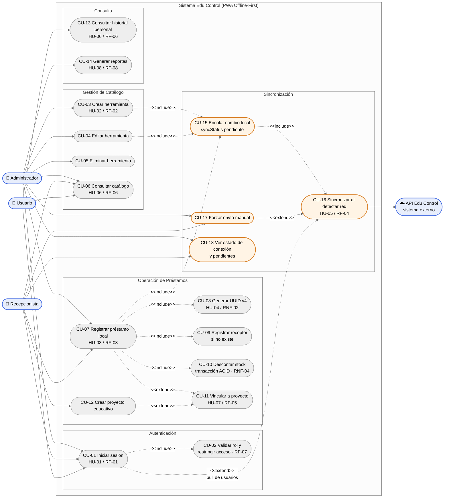

```mermaid
%%{init: {'theme':'neutral'}}%%
flowchart LR
    ADMIN(["👤 Administrador"])
    RECEP(["👤 Recepcionista"])
    USER(["👤 Usuario"])
    NUBE(["☁️ API Edu Control<br/>sistema externo"])

    subgraph SISTEMA["Sistema Edu Control &lpar;PWA Offline-First&rpar;"]
        direction TB

        subgraph AUTH["Autenticación"]
            CU01(["CU-01 Iniciar sesión<br/>HU-01 / RF-01"])
            CU02(["CU-02 Validar rol y<br/>restringir acceso · RF-07"])
        end

        subgraph CATALOGO["Gestión de Catálogo"]
            CU03(["CU-03 Crear herramienta<br/>HU-02 / RF-02"])
            CU04(["CU-04 Editar herramienta"])
            CU05(["CU-05 Eliminar herramienta"])
            CU06(["CU-06 Consultar catálogo<br/>HU-06 / RF-06"])
        end

        subgraph OPERACION["Operación de Préstamos"]
            CU07(["CU-07 Registrar préstamo local<br/>HU-03 / RF-03"])
            CU08(["CU-08 Generar UUID v4<br/>HU-04 / RNF-02"])
            CU09(["CU-09 Registrar receptor<br/>si no existe"])
            CU10(["CU-10 Descontar stock<br/>transacción ACID · RNF-04"])
            CU11(["CU-11 Vincular a proyecto<br/>HU-07 / RF-05"])
            CU12(["CU-12 Crear proyecto educativo"])
        end

        subgraph CONSULTA["Consulta"]
            CU13(["CU-13 Consultar historial personal<br/>HU-06 / RF-06"])
            CU14(["CU-14 Generar reportes<br/>HU-08 / RF-08"])
        end

        subgraph SYNC["Sincronización"]
            CU15(["CU-15 Encolar cambio local<br/>syncStatus pendiente"])
            CU16(["CU-16 Sincronizar al detectar red<br/>HU-05 / RF-04"])
            CU17(["CU-17 Forzar envío manual"])
            CU18(["CU-18 Ver estado de conexión<br/>y pendientes"])
        end
    end

    ADMIN --> CU01
    ADMIN --> CU03
    ADMIN --> CU04
    ADMIN --> CU05
    ADMIN --> CU06
    ADMIN --> CU07
    ADMIN --> CU14
    ADMIN --> CU17
    ADMIN --> CU18

    RECEP --> CU01
    RECEP --> CU06
    RECEP --> CU07
    RECEP --> CU12
    RECEP --> CU17
    RECEP --> CU18

    USER --> CU01
    USER --> CU06
    USER --> CU13

    CU01 -.->|"&lt;&lt;include&gt;&gt;"| CU02
    CU07 -.->|"&lt;&lt;include&gt;&gt;"| CU08
    CU07 -.->|"&lt;&lt;include&gt;&gt;"| CU09
    CU07 -.->|"&lt;&lt;include&gt;&gt;"| CU10
    CU07 -.->|"&lt;&lt;include&gt;&gt;"| CU15
    CU07 -.->|"&lt;&lt;extend&gt;&gt;"| CU11
    CU12 -.->|"&lt;&lt;extend&gt;&gt;"| CU11
    CU03 -.->|"&lt;&lt;include&gt;&gt;"| CU15
    CU04 -.->|"&lt;&lt;include&gt;&gt;"| CU15
    CU15 -.->|"&lt;&lt;include&gt;&gt;"| CU16
    CU17 -.->|"&lt;&lt;extend&gt;&gt;"| CU16
    CU01 -.->|"&lt;&lt;extend&gt;&gt;<br/>pull de usuarios"| CU16

    CU16 --> NUBE

    classDef actor fill:#e8eefc,stroke:#4169e1,stroke-width:2px
    classDef uc fill:#ffffff,stroke:#7a8699
    classDef hu05 fill:#fff4e5,stroke:#d9822b,stroke-width:2px
    class ADMIN,RECEP,USER,NUBE actor
    class CU15,CU16,CU17,CU18 hu05
```