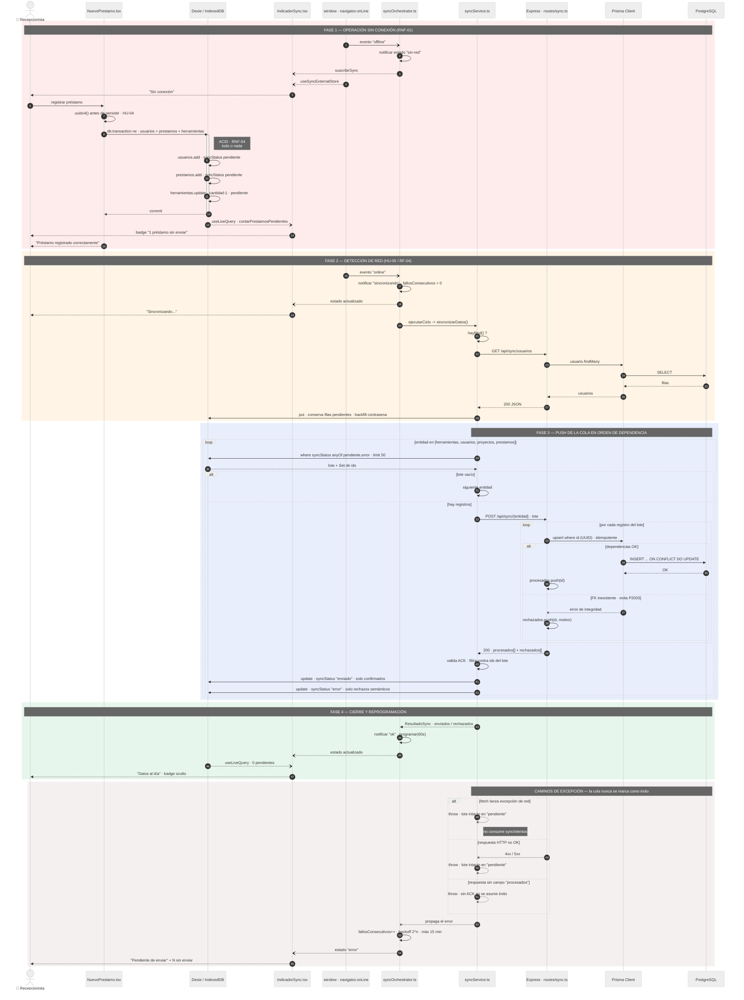

```mermaid
%%{init: {'theme':'neutral'}}%%
sequenceDiagram
    autonumber
    actor REC as 👤 Recepcionista
    participant NP as NuevoPrestamo.tsx
    participant DX as Dexie / IndexedDB
    participant IND as IndicadorSync.tsx
    participant WIN as window · navigator.onLine
    participant ORQ as syncOrchestrator.ts
    participant SVC as syncService.ts
    participant API as Express · routes/sync.ts
    participant PR as Prisma Client
    participant PG as PostgreSQL

    rect rgb(253, 236, 235)
    Note over REC,PG: FASE 1 — OPERACIÓN SIN CONEXIÓN (RNF-01)

    WIN-)ORQ: evento "offline"
    ORQ->>ORQ: notificar estado "sin-red"
    ORQ--)IND: suscribirSync
    WIN--)IND: useSyncExternalStore
    IND-->>REC: "Sin conexión"

    REC->>NP: registrar préstamo
    NP->>NP: uuidv4() antes de persistir · HU-04

    NP->>DX: db.transaction rw · usuarios + prestamos + herramientas
    activate DX
    Note right of DX: ACID · RNF-04<br/>todo o nada
    DX->>DX: usuarios.add · syncStatus pendiente
    DX->>DX: prestamos.add · syncStatus pendiente
    DX->>DX: herramientas.update · cantidad-1 · pendiente
    DX-->>NP: commit
    deactivate DX

    DX--)IND: useLiveQuery · contarPrestamosPendientes
    IND-->>REC: badge "1 préstamo sin enviar"
    NP-->>REC: "Préstamo registrado correctamente"
    end

    rect rgb(255, 244, 229)
    Note over REC,PG: FASE 2 — DETECCIÓN DE RED (HU-05 / RF-04)

    WIN-)ORQ: evento "online"
    ORQ->>ORQ: notificar "sincronizando" · fallosConsecutivos = 0
    ORQ--)IND: estado actualizado
    IND-->>REC: "Sincronizando..."
    ORQ->>SVC: ejecutarCiclo -> sincronizarDatos()

    SVC->>SVC: hayRed() ?
    SVC->>API: GET /api/sync/usuarios
    API->>PR: usuario.findMany
    PR->>PG: SELECT
    PG-->>PR: filas
    PR-->>API: usuarios
    API-->>SVC: 200 JSON
    SVC->>DX: put · conserva filas pendientes · backfill contrasena
    end

    rect rgb(232, 238, 252)
    Note over SVC,PG: FASE 3 — PUSH DE LA COLA EN ORDEN DE DEPENDENCIA

    loop entidad en [herramientas, usuarios, proyectos, prestamos]
        SVC->>DX: where syncStatus anyOf pendiente,error · limit 50
        DX-->>SVC: lote + Set de ids

        alt lote vacío
            SVC->>SVC: siguiente entidad
        else hay registros
            SVC->>API: POST /api/sync/{entidad} · lote

            loop por cada registro del lote
                API->>PR: upsert where id (UUID) · idempotente
                alt dependencias OK
                    PR->>PG: INSERT ... ON CONFLICT DO UPDATE
                    PG-->>PR: OK
                    API->>API: procesados.push(id)
                else FK inexistente · evita P2003
                    PR--xAPI: error de integridad
                    API->>API: rechazados.push(id, motivo)
                end
            end

            API-->>SVC: 200 · procesados[] + rechazados[]
            SVC->>SVC: valida ACK · filtra contra ids del lote
            SVC->>DX: update · syncStatus "enviado" · solo confirmados
            SVC->>DX: update · syncStatus "error" · solo rechazos semánticos
        end
    end
    end

    rect rgb(231, 246, 236)
    Note over REC,PG: FASE 4 — CIERRE Y REPROGRAMACIÓN

    SVC-->>ORQ: ResultadoSync · enviados / rechazados
    ORQ->>ORQ: notificar "ok" · programar(60s)
    ORQ--)IND: estado actualizado
    DX--)IND: useLiveQuery · 0 pendientes
    IND-->>REC: "Datos al día" · badge oculto
    end

    rect rgb(245, 240, 240)
    Note over SVC,PG: CAMINOS DE EXCEPCIÓN — la cola nunca se marca como éxito

    alt fetch lanza excepción de red
        SVC--xSVC: throw · lote intacto en "pendiente"
        Note right of SVC: no consume syncIntentos
    else respuesta HTTP no OK
        API--xSVC: 4xx / 5xx
        SVC--xSVC: throw · lote intacto en "pendiente"
    else respuesta sin campo "procesados"
        SVC--xSVC: throw · sin ACK no se asume éxito
    end

    SVC--xORQ: propaga el error
    ORQ->>ORQ: fallosConsecutivos++ · backoff 2^n · máx 15 min
    ORQ--)IND: estado "error"
    IND-->>REC: "Pendiente de enviar" + N sin enviar
    end
```