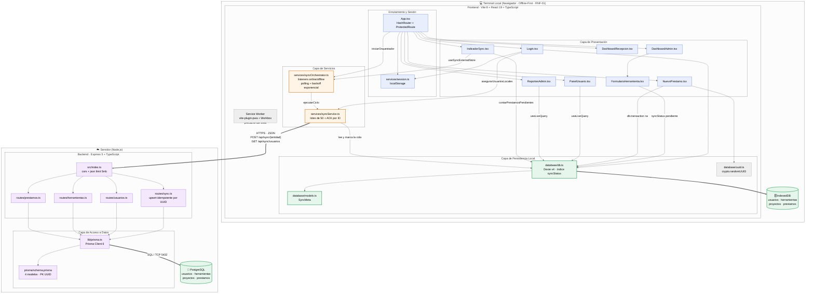

```mermaid
%%{init: {'theme':'neutral'}}%%
flowchart TB
    subgraph CLIENTE["💻 Terminal Local &lpar;Navegador · Offline-First · RNF-01&rpar;"]
        direction TB

        subgraph PWA["Frontend · Vite 8 + React 19 + TypeScript"]
            direction TB

            subgraph UI["Capa de Presentación"]
                LOGIN["Login.tsx"]
                DASHADM["DashboardAdmin.tsx"]
                DASHREC["DashboardRecepcion.tsx"]
                FORMH["FormularioHerramienta.tsx"]
                NUEVOP["NuevoPrestamo.tsx"]
                PANELU["PanelUsuario.tsx"]
                REPORTES["ReportesAdmin.tsx"]
                INDICADOR["IndicadorSync.tsx"]
            end

            subgraph ROUTER["Enrutamiento y Sesión"]
                APP["App.tsx<br/>HashRouter + ProtectedRoute"]
                SESSION["services/session.ts<br/>localStorage"]
            end

            subgraph SERVICIOS["Capa de Servicios"]
                ORQ["services/syncOrchestrator.ts<br/>listeners online/offline<br/>polling + backoff exponencial"]
                SYNCSVC["services/syncService.ts<br/>lotes de 50 + ACK por ID"]
            end

            subgraph DATOS["Capa de Persistencia Local"]
                DEXIE["database/db.ts<br/>Dexie v4 · índice syncStatus"]
                MODELS["database/models.ts<br/>SyncMeta"]
                UUIDGEN["database/uuid.ts<br/>crypto.randomUUID"]
            end

            SW["Service Worker<br/>vite-plugin-pwa + Workbox"]
        end

        IDB[("🗄️ IndexedDB<br/>usuarios · herramientas<br/>proyectos · prestamos")]
    end

    subgraph NUBE["☁️ Servidor &lpar;Node.js&rpar;"]
        direction TB

        subgraph API["Backend · Express 5 + TypeScript"]
            INDEX["src/index.ts<br/>cors + json limit 5mb"]
            RSYNC["routes/sync.ts<br/>upsert idempotente por UUID"]
            RUSU["routes/usuarios.ts"]
            RHERR["routes/herramientas.ts"]
            RPREST["routes/prestamos.ts"]
        end

        subgraph ORM["Capa de Acceso a Datos"]
            PRISMA["lib/prisma.ts<br/>Prisma Client 6"]
            SCHEMA["prisma/schema.prisma<br/>4 modelos · PK UUID"]
        end

        PG[("🐘 PostgreSQL<br/>usuarios · herramientas<br/>proyectos · prestamos")]
    end

    LOGIN --> SESSION
    LOGIN --> DEXIE
    LOGIN -->|"asegurarUsuariosLocales"| SYNCSVC
    APP --> LOGIN
    APP --> DASHADM
    APP --> DASHREC
    APP --> PANELU
    APP --> REPORTES
    APP --> NUEVOP
    APP --> INDICADOR
    APP -->|"iniciarOrquestador"| ORQ
    APP --> SESSION
    DASHADM --> FORMH

    FORMH -->|"syncStatus pendiente"| DEXIE
    NUEVOP -->|"db.transaction rw"| DEXIE
    NUEVOP --> UUIDGEN
    PANELU -->|"useLiveQuery"| DEXIE
    REPORTES -->|"useLiveQuery"| DEXIE
    INDICADOR -->|"useSyncExternalStore"| ORQ
    INDICADOR -->|"contarPrestamosPendientes"| DEXIE

    DEXIE --> MODELS
    DEXIE ==> IDB
    ORQ -->|"ejecutarCiclo"| SYNCSVC
    SYNCSVC -->|"lee y marca la cola"| DEXIE
    SW -.->|"precache del shell"| PWA

    SYNCSVC ==>|"HTTPS · JSON<br/>POST /api/sync/{entidad}<br/>GET /api/sync/usuarios"| INDEX

    INDEX --> RSYNC
    INDEX --> RUSU
    INDEX --> RHERR
    INDEX --> RPREST
    RSYNC --> PRISMA
    RUSU --> PRISMA
    RHERR --> PRISMA
    RPREST --> PRISMA
    PRISMA --> SCHEMA
    PRISMA ==>|"SQL / TCP 5432"| PG

    classDef ui fill:#e8eefc,stroke:#4169e1
    classDef svc fill:#fff4e5,stroke:#d9822b,stroke-width:2px
    classDef db fill:#e7f6ec,stroke:#2e9e5b,stroke-width:2px
    classDef be fill:#f3e8fc,stroke:#8b5cf6
    class LOGIN,DASHADM,DASHREC,FORMH,NUEVOP,PANELU,REPORTES,INDICADOR,APP,SESSION ui
    class ORQ,SYNCSVC svc
    class IDB,PG,DEXIE,MODELS db
    class INDEX,RSYNC,RUSU,RHERR,RPREST,PRISMA,SCHEMA be
```